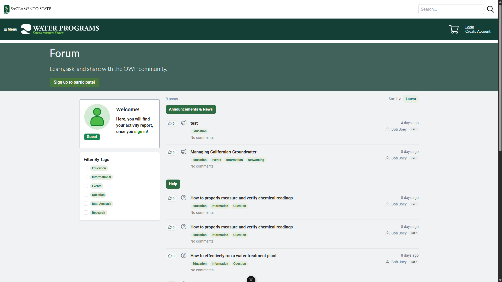
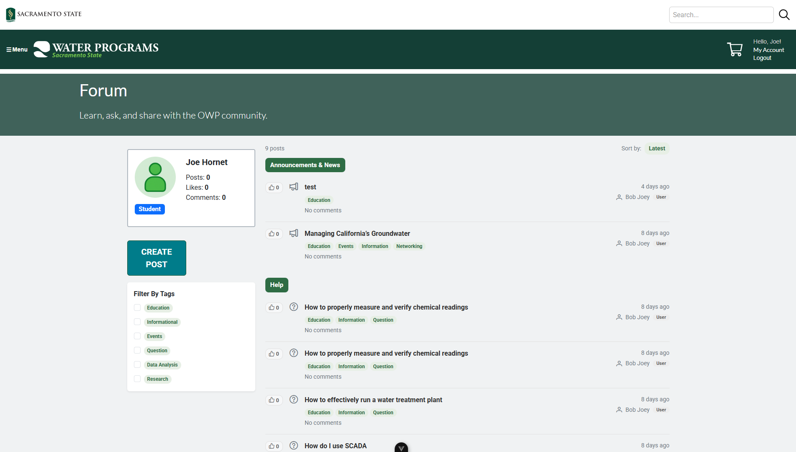
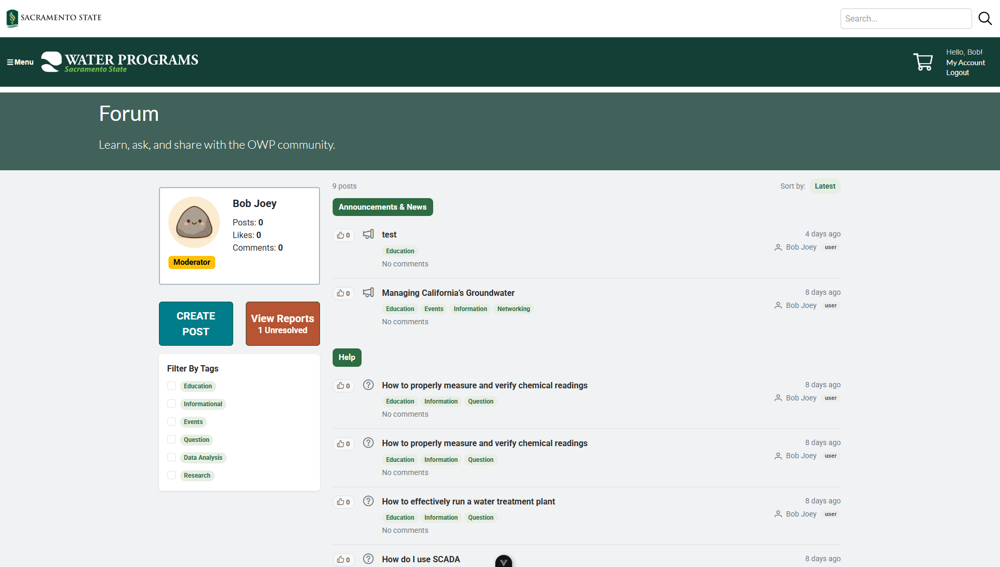
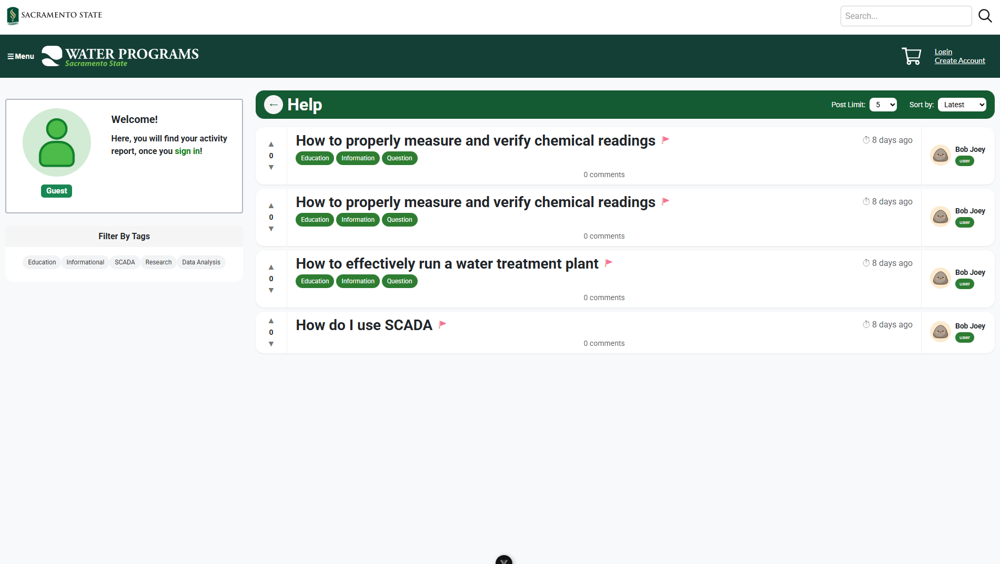
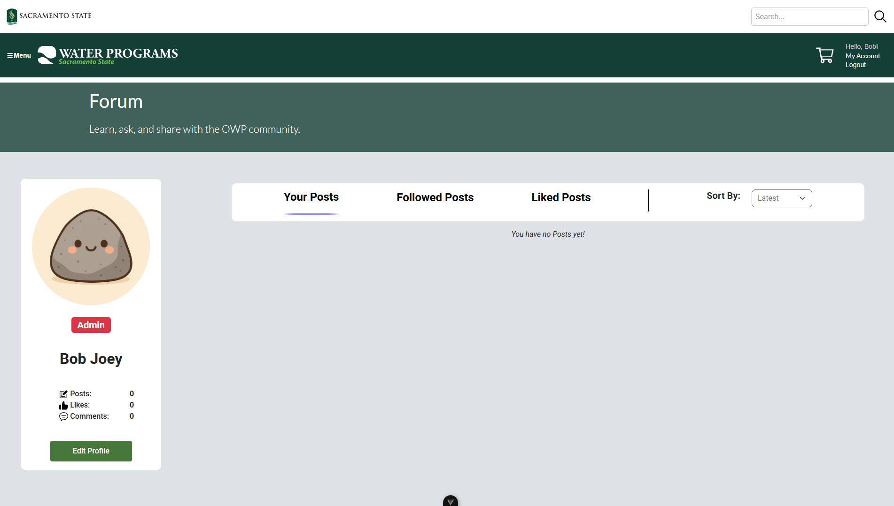
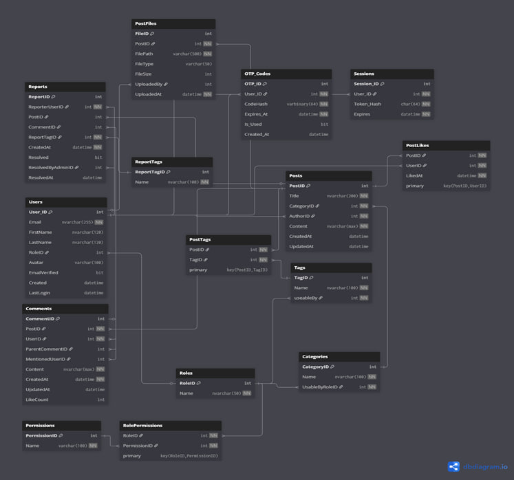

# OWP Forum
> The Office of Water Programs (OWP) at Sacramento State is a global authority in water and wastewater treatment training and research.


This is a web-based forum application being developed as our senior project for the Office of Water Programs.
Its purpose is to bridge the gap between communication and learning by allowing students and
professionals to interact, share knowledge, and support each other in gaining valuable information related to 
water programs and initiatives. The platform provides a space for posts, comments, and real-time updates—supporting deeper engagement with water program training and initiatives.

---

## 🚀 Core Features

### 🔐 Authentication & User Access

* Email-based login system
* One-time passcode (OTP) sent through mail server
* Secure account registration requiring:

  * First & last name
  * Email (used as username)
  * Last 4 digits of SSN (identity verification)

### 🧩 Role-Based Permissions

| Role                        | Permissions                                                                     |
| --------------------------- | ------------------------------------------------------------------------------- |
| **Admin**                   | Assign roles, post with official tagging, view all reports, full system control |
| **Moderator**               | Edit and recategorize posts, remove content, view reports                       |
| **Student**                 | Create posts, comment, like, report content                                     |
| **Guest (Unauthenticated)** | Read-only access — no login required                                            |

### 📝 Posting & Interaction Features

* Create discussion threads with:

  * Text
  * Images
  * Video support
* Upvote / Downvote system for engagement
* Commenting system with email notifications
* Search functionality for posts, topics, and tags

### ♿ Accessibility & Design

* Developed to meet **WCAG accessibility standards**
* Fully responsive UI — mobile, tablet, and desktop supported
* Styled with Sac State colors and branding

### 🗄 Technology Stack

| Layer | Technology |
| :--- | :--- |
| **Frontend** |  |
| **Backend** |   |
| **Database** |  |
| **Build Goal** | Cloud-deployable production system |

---

##  Prototype Images

<details>
 <summary> Home Page</summary>

| Not Logged in  | Logged in   | Logged in as Mod/Admin |
| -------------- | ----------- | ---------------------- |
|  |  |  |
</details>

<details>
 <summary> View a Specific Category</summary>

Similar for all roles.


</details>

<details>
 <summary> Viewing a Specific Post</summary> 

| Not Logged in  | Logged in   | Logged in as Mod/Admin |
| -------------- | ----------- | ---------------------- |
|  |  |  |

###  Creating a Post

| Logged in as User/Student | Logged in as Mod/Admin |
| ------------------------- | ---------------------- |
|  |  |

</details>

<details>
 <summary> User Forum Profile</summary>

Similar for all roles.


</details>

---

## 📸 Actual Website Images

Screenshots of the live, implemented OWP Forum application.

<details>
 <summary>🏠 Home Page</summary>

| Not Logged in  | Logged in   | Logged in as Mod/Admin |
| -------------- | ----------- | ---------------------- |
|  |  |  |
</details>

<details>
 <summary>📂 Category View</summary>

Similar for all roles.


</details>

<details>
 <summary>👤 User Profile</summary>

Similar for all roles.


</details>

---
## 🗂️ Entity Relationship Diagram (ERD)

The Entity Relationship Diagram (ERD) below outlines the full database structure behind the OWP Forum.  
It shows how core components—such as users, posts, comments, tags, categories, roles, permissions, and reporting—connect to form a secure and scalable forum ecosystem.

Key highlights of the database design:

- **User & Authentication System:**  
  Includes users, sessions, OTP codes, roles, and permissions to support secure login and role-based access control.

- **Forum Content Structure:**  
  Posts link to authors, categories, tags, attached media, and user interactions such as likes and comments.

- **Moderation & Reporting:**  
  Users can report posts or comments, which tie into report categories and moderation workflows.

- **Flexible Tagging & Categorization:**  
  Many-to-many relationships allow posts to have multiple tags, enabling advanced filtering and search.

This structure ensures data integrity while supporting all major features of the platform, including posting, comment threads, moderation tools, and user identity verification.

### 📘 ERD Diagram

---

## Getting Started

Follow these instructions to get a local copy of the project up and running.

### Prerequisites

Before you begin, ensure you have the following installed:
* [Node.js and npm](https://nodejs.org/)
  
* [PHP](https://www.php.net/downloads.php)
  thread-safe preferred version: 8.3
  
* [Composer](https://getcomposer.org/)
  
* [PHP SQL Server Drivers](https://learn.microsoft.com/en-us/sql/connect/php/download-drivers-php-sql-server?view=sql-server-ver17)
  PHP SQL server drivers from Microsoft & ODBC driver

## ⚙️ Setup Instructions

### 1. Frontend Setup

1. Navigate to frontend directory:
   ```bash
   cd frontend
   ```

2. Install all required npm packages:
   ```bash
   npm install
   ```

3. Run the frontend development server:
   ```bash
   npm run dev
   ```

### 2. Backend Setup
1. Extract PHP to the desired directory and create a new **system environmental variable** for the path to the PHP installation.
2. From the **SQLSRV512.ZIP** file you downloaded, copy the drivers **php_pdo_sqlsrv_83_ts_x64.dll** & **php_sqlsrv_83_ts_x64.dll** or equivalent drivers for the version of PHP you downloaded and paste them into the **ext** file inside your PHP installation
3. Make a copy of the file **php.ini-development** inside your PHP installation, paste it inside your PHP installation, and rename it to **php.ini**.
4. Inside **php.ini**, remove the **;** from in front of **extension=openssl** and paste the follwing extensions below or their equivalents under **;zend_extension=opcache**.
   ```bash
   extension=php_sqlsrv_83_ts_x64.dll
   extension=php_pdo_sqlsrv_83_ts_x64.dll
   ```
6. Copy the path of the **ext** file, inside your PHP installation file, and paste it inside the double quotes of the extension directory inside php.ini then save php.ini.
   ```bash
   ; On windows:
   extension_dir = "paste directory here"
   ```
7. In a **new terminal window**, navigate to the backend directory from the project root:
   ```bash
   cd backend
   ```
8. Install the required PHP dependencies using Composer:
   ```bash
   composer require slim/slim slim/psr7 vlucas/phpdotenv
   ```
9. **Ensure You Have Configured Your Environment Variables:** The backend needs credentials to run.
   * First, copy the example `.env.example` file to create your own local configuration file:
   ```bash
   cp .env.example .env
   ```
   * Next, open the new `.env` file.
   * Fill in the required parameters (database credentials, application secrets) with your correct development values.

---

## 📅 Timeline
This timeline tracks our project's progress across CSC 190 and CSC 191

### Phase I: 🍂 Fall 2025 (CSC 190)

| Sprint | Key Features / Goals | Status |
| ------ | ------------------- | ------ |
| **01** | Developed and finalized Figma Prototypes, established project scope in the **Project Charter**, and defined initial requirements/tech stack. | **DONE** |
| **02** | Set up **Git/Jira environment**, implemented the **Login/Register UI**, connected Authentication to the database backend, and built base site components (Headers/Footer). | **DONE** |
| **03** | Implemented **Authentication Logic**, developed **Create Post Page**, initiated backend for Tags/Categories, and built the **User Profile Page** for settings. | **DONE** |
| **04** | Fixed issues with **Create Post Page**, implemented functional **Category View**, updated **Homepage** to display posts, and signed the Project Charter. | **DONE** |

### Phase II: 🌷 Spring 2026 (CSC 191)

| Sprint | Key Features / Goals | Status |
| ------ | ------------------- | ------ |
| **05** | Adjustments to **Homepage** layout, convert the **Create Post Page into a Modal**, create the **Post View Page**, implement **Commenting**, and enable user **Post Reporting** functionality.| **TODO** |
| **06** | Implement **Admin Panel** for role assignment, user **Notifications**, author **Post Editing Privileges**, and Admin/Mod post moderation (Move/Delete posts). | **TODO** |
| **07** | Work on **Bug Fixes**, perform full-site **Testing**, and make necessary final adjustments based on testing results. | **TODO** |
| **08** | Final application preparation and official environment **Deployment** for production. | **TODO** |

---

## 🧪 Testing 
TBD

---

## Deployment
TBD

---

## 🧑‍💻 Contributing
This guide details the steps and standards required for contributing code to the OWP Forum project. All contributions must be linked to a story or subtask in Jira (using format **BB-123**).
### 1. Branching
All development work must be performed in a dedicated feature branch

1. **Pull the latest changes** from the development branch (`dev`):
   ```bash
   git checkout dev
   git pull origin dev
   ```
2. **Create your branch** directly from `dev`. The branch name ***must*** correspond to your assigned Jira story key:
   ```bash
   git checkout -b BB-123-your-story-description
   ```
   > *Example Branch Name: `BB-123-implement-login-otp-logic`*

### 2. Committing
Each commit must address one specific change and clearly linked to a relevant Jira subtask.

1. **Stage your changes:**
   ```bash
   git add .
   ```
2. **Commit Message Format:** The message must begin with the related Jira **subtask** key, followed by a clear explanation of the work done:
   ```bash
   git commit -m "BB-23: Add sign-in button to login page"
   ```

### 3. Pull Request & Review
Once you're done working on your story, you will submit your code for peer review.

1. **Push your branch** to the repository:
   ```bash
   git push origin BB-123-your-story-description
   ```
2. **Create a Pull Request** on GitHub to the **`dev`** branch.
3. **Peer Review:** The PR must receive **at least one approval** from one of the team members before being merged.
4. **Cleanup:** After the PR is merged into `dev`, the original feature branch **must be deleted**.

---

## 🙏 Acknowledgments

This project is developed as part of the CSC 190/191 Senior Project sequence at  
**California State University, Sacramento**.

We would like to thank:

- **Instructor:** Dr. Kenneth Elliot  
- **Lab Advisor:** Prof. Harvin Singh  
- **Office of Water Programs (OWP)** for partnering with us and providing project requirements and feedback.

---

## 👥 Contributors

- Maksim Shkrabak
- Daniel Ivanilov
- Jeffrey Sardella
- Oleksii Andriienko
- Egor Strakhov
- Ruzanna Shomakhova
- Gianni Dumitru
- Gavin Kabel

---

<p align="center">
 
 <br>
 <strong>Copyright © 2025 OWP Forum | Team Bug Busters</strong>
</p>
