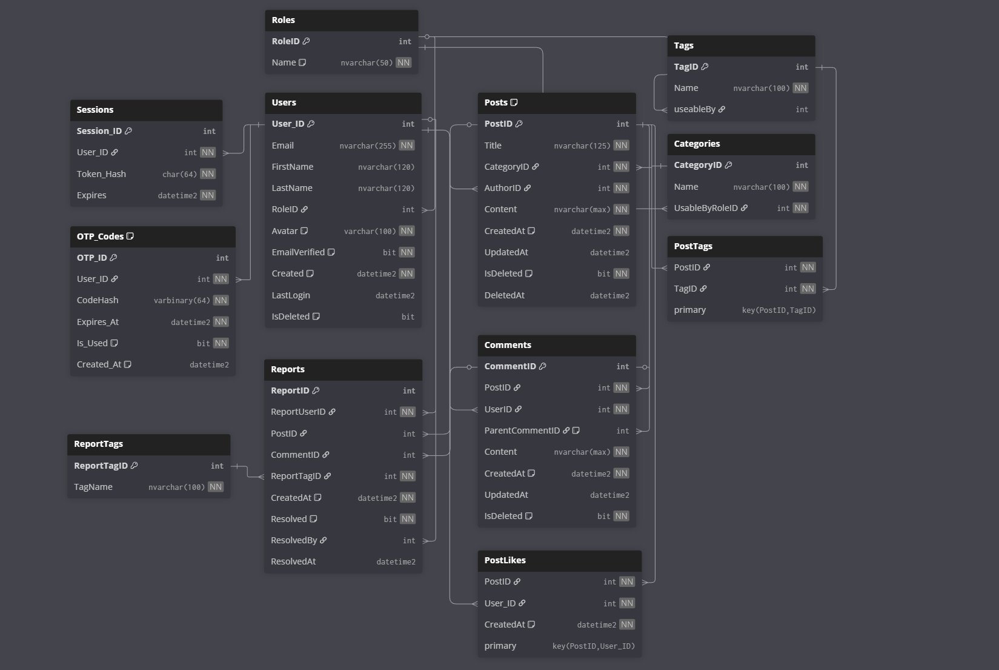

# OWP Forum
> The Office of Water Programs (OWP) at Sacramento State is a global authority in water and wastewater treatment training and research.


This is a web-based forum application being developed as our senior project for the Office of Water Programs.
Its purpose is to bridge the gap between communication and learning by allowing students and
professionals to interact, share knowledge, and support each other in gaining valuable information related to 
water programs and initiatives. The platform provides a space for posts, comments, and real-time updates—supporting deeper engagement with water program training and initiatives.

---

## 🚀 Core Features

### 🔐 Authentication & User Access

* Email-based login system
* One-time passcode (OTP) sent through mail server
* Secure account registration requiring:

  * First & last name
  * Email (used as username)
  * Last 4 digits of SSN (identity verification)

### 🧩 Role-Based Permissions

| Role                        | Permissions                                                                     |
| --------------------------- | ------------------------------------------------------------------------------- |
| **Admin**                   | Assign roles, post with official tagging, view all reports, full system control |
| **Moderator**               | Edit and recategorize posts, remove content, view reports                       |
| **User / Student**                 | Create posts, comment, like, report content                                     |
| **Guest (Unauthenticated)** | Read-only access — no login required                                            |

### 📝 Posting & Interaction Features

* Create discussion threads with:
  * Rich Text
  * Hyperlinks
  * Images
* Upvote / Downvote system for engagement
* Commenting system with email notifications
* Upvoting and commenting with browser notifications
* Search functionality for posts, categories, tags, and users

### 🗄 Technology Stack

| Layer | Technology |
| :--- | :--- |
| **Frontend** |  |
| **Backend** |   |
| **Database** |  |
| **Build Goal** | Cloud-deployable production system |

---

##  Prototype Images

<details>
 <summary> Home Page</summary>

| Not Logged in  | Logged in   | Logged in as Mod/Admin |
| -------------- | ----------- | ---------------------- |
|  |  |  |
</details>

<details>
 <summary> View a Specific Category</summary>

Similar for all roles.


</details>

<details>
 <summary> Viewing a Specific Post</summary> 

| Not Logged in  | Logged in   | Logged in as Mod/Admin |
| -------------- | ----------- | ---------------------- |
|  |  |  |

###  Creating a Post

| Logged in as User/Student | Logged in as Mod/Admin |
| ------------------------- | ---------------------- |
|  |  |

</details>

<details>
 <summary> User Forum Profile</summary>

Similar for all roles.


</details>

---

## 📸 Live Website Images
<details>
 <summary></summary>

   <h6>╭┈➤&emsp;🏠 Browser Notifications for signed up users visible on any page for comments and upvotes by other people on your post.</h6>
   

   <h6>╭┈➤&emsp;🏠 Search up posts that have a matching Title, Category, Tag, Author Name, or Role. Additionally filter with the category filter.</h6>
   

   <h6>╭┈➤&emsp;🏠 When you receive no results on a too-specific search.</h6>
   

   <h6>╭┈➤&emsp;🏠 Category filter to only see selected categories on the home page, limited to 5 posts per category by default. Click Category header to visit Category-specific view.</h6>
   

   <h6>╭┈➤&emsp;📁 Tag Filter usable within the page of Category-specific view.</h6>
   

   <h6>╭┈➤&emsp;📝 View a post. Share button to copy link, Upvote/Downvote, see view counter, and click on author to visit their profile!</h6>
   

   <h6>╭┈➤&emsp;📝 Comment section past the post, with nested replies of depth 2 at most. Sort button for comments. Click author to route to their profile.</h6>
   

   <h6>╭┈➤&emsp;🙍‍♂️ Other Users' profiles. See their statistics and posts with sort options.</h6>
   

   <h6>╭┈➤&emsp;🙍‍♂️ User's own profile. View your own statistics and posts with sort options.</h6>
   

   <h6>╭┈➤&emsp;🙍‍♂️ User's own profile. View posts you liked/upvoted.</h6>
   

   <h6>╭┈➤&emsp;🙍‍♂️ User's own profile. Edit your profile, with editable pre-made avatars designed by Ruzanna Shomakhova and notification preferences.</h6>
   
</details>

<details>
   <summary>
   </summary>

   <h6>╭┈➤&emsp;🔑 Registration Page for new users with valid Names, SSNs, and Emails. </h6>
   

   <h6>╭┈➤&emsp;🔑 Login Page for returning users. Enter email to receive an email in-return to proceed further.</h6>
   

   <h6>╭┈➤&emsp;🔑 Verification Page. Enter received One-Time Password from the email to procceed as logged in.</h6>
   

   <h6>╭┈➤&emsp;🏠 Guest Users' homepage with no ability to makes posts, reports, or upvote/downvote.</h6>
   

   <h6>╭┈➤&emsp;📁 Guest Users' Category-specific view.</h6>
   

   <h6>╭┈➤&emsp;📁 Guest Users' Category-specific view.</h6>
   

   <h6>╭┈➤&emsp;📝 View posts as guest with no ability to report, upvote/downvote.</h6>
   

   <h6>╭┈➤&emsp;📝 View posts' comments with no ability to comment/reply, upvote/downvote, or report comments.</h6>
   
</details>


<details>
 <summary><strong></strong></summary>

   <h6>╭┈➤&emsp;🏠 Homepage as User with ability to create, upvote/downvote, and report posts.</h6>
   

   <h6>╭┈➤&emsp;🏠 Create post with fields for title, category, up to 5 tags, and main content with rich text editor.</h6>
   

   <h6>╭┈➤&emsp;📁 Category-specific view with ability to create posts.</h6>
   

   <h6>╭┈➤&emsp;📁 Category-specific view with ability to create posts.</h6>
   

   <h6>╭┈➤&emsp;📝 View others' posts with ability to upvote/downvote, report, and count toward view count.</h6>
   

   <h6>╭┈➤&emsp;📝 View your own post with ability to edit or delete it.</h6>
   

   <h6>╭┈➤&emsp;📝 Viewing a post with disabled comments, without the ability to comment.</h6>
   

   <h6>╭┈➤&emsp;📝 Report a post that you are not the author of.</h6>
   

   <h6>╭┈➤&emsp;📝 Report a comment that you are not the author of.</h6>
   
</details>

<details>
 <summary></summary>

   <h6>╭┈➤&emsp;🏠 Homepage as moderator with the button to view users' and students' post/comment reports.</h6>
   

   <h6>╭┈➤&emsp;📁 Category-specific view as moderator with the button to view users' and students' post/comment reports.</h6>
   
</details>

<details>
 <summary></summary>

   <h6>╭┈➤&emsp;🏠 Homepage with the ability to pin posts to the top of their categories.</h6>
   

   <h6>╭┈➤&emsp;🏠 Homepage with the ability to create posts using Announcements category, official tag, and disable comments on the post.</h6>
   

   <h6>╭┈➤&emsp;🏠 Homepage with ability to view reports by users and students. Sort reports, route to them (scroll to comment for comment reports), or resolve.</h6>
   

   <h6>╭┈➤&emsp;📝 View post with ability to edit or delete any post, no matter if you are the author or not.</h6>
   

   <h6>╭┈➤&emsp;📝 View comments with ability to edit or delete and comments, no matter if you are the author or not.</h6>
   
</details>

<details>
 <summary></summary>

   <h6>╭┈➤&emsp;🏠 Homepage with button to route to the Admin Panel.</h6>
   

   <h6>╭┈➤&emsp;📁 Category-specific view with button to route to the Admin Panel.</h6>
   

   <h6>╭┈➤&emsp;🛡️ Admin Panel with ability to view/search and sort users, and modify their roles and ban status.</h6>
   

   <h6>╭┈➤&emsp;🛡️ Admin Panel to manage category names, who it is useable by, who it is visible to, and delete them.</h6>
   

   <h6>╭┈➤&emsp;🛡️ Admin panel form to create a category.</h6>
   

   <h6>╭┈➤&emsp;🛡️ Admin Panel to manage tag names, who it is useable by, and delete them.</h6>
   

   <h6>╭┈➤&emsp;🛡️ Admin panel form to create a tag.</h6>
   

   <h6>╭┈➤&emsp;🛡️ Admin panel to manage report tag names and delete them. Alternative way to view users' and students' reports with more information.</h6>
   

   <h6>╭┈➤&emsp;🛡️ Admin panel form to create a report tag.</h6>
   
</details>

---
## 🗂️ Entity Relationship Diagram (ERD)

The Entity Relationship Diagram (ERD) below outlines the full database structure behind the OWP Forum.  
It shows how core components—such as users, posts, comments, tags, categories, roles, permissions, and reporting—connect to form a secure and scalable forum ecosystem.

Key highlights of the database design:

- **User & Authentication System:**  
  Includes users, sessions, OTP codes, roles, and permissions to support secure login and role-based access control.

- **Forum Content Structure:**  
  Posts link to authors, categories, tags, attached media, and user interactions such as likes and comments.

- **Moderation & Reporting:**  
  Users can report posts or comments, which tie into report categories and moderation workflows.

- **Flexible Tagging & Categorization:**  
  Many-to-many relationships allow posts to have multiple tags, enabling advanced filtering and search.

This structure ensures data integrity while supporting all major features of the platform, including posting, comment threads, moderation tools, and user identity verification.

### 📘 ERD Diagram

---

## Getting Started

Follow these instructions to get a local copy of the project up and running.

### Prerequisites

Before you begin, ensure you have the following installed. The versions listed are what the project has been developed and tested against — other versions may work but are not guaranteed.

* [Node.js and npm](https://nodejs.org/) - **Node.js v24.14.0**, **npm 11.9.0**

* [PHP](https://www.php.net/downloads.php) - **PHP 8.3**, Thread-Safe / VS16 x64 ZIP, tested with **PHP 8.3.27**

* [Composer](https://getcomposer.org/) — **Composer 2.8.12**

* [PHP SQL Server Drivers](https://learn.microsoft.com/en-us/sql/connect/php/download-drivers-php-sql-server?view=sql-server-ver17)

## ⚙️ Setup Instructions

### 1. Frontend Setup

1. Navigate to frontend directory:
   ```bash
   cd frontend
   ```

2. Install all required npm packages:
   ```bash
   npm install
   ```

3. Run the frontend development server:
   ```bash
   npm run dev
   ```

4. Click or type the Local link:
   ```bash
   ➜ Local:  http://localhost:5173/
   ```

### 2. Backend Setup
1. Download the PHP **Thread-Safe / VS16 x64 ZIP** and extract it to a folder on your computer, such as `C:\php-8.3.27-Win32-vs16-x64`. Add the extracted PHP folder (the folder containing `php.exe`) to the system **Path** environment variable.
2. From the **SQLSRV5.13.1_Windows.zip** file you downloaded, copy the thread-safe x64 drivers **php_pdo_sqlsrv_83_ts_x64.dll** and **php_sqlsrv_83_ts_x64.dll**, or equivalent drivers for the version of PHP you downloaded, and paste them into the **ext** file inside your PHP installation.
3. Make a copy of **php.ini-development** inside your PHP installation folder and rename the copy to **php.ini**.
4. Inside **php.ini**, remove the **;** from in front of **extension=openssl** and **extension=mbstring**, then paste the following SQL Server extensions below or their equivalents under **;zend_extension=opcache**.
   ```bash
   extension=php_sqlsrv_83_ts_x64.dll
   extension=php_pdo_sqlsrv_83_ts_x64.dll
   ```
5. Copy the path of the **ext** folder inside your PHP installation folder and paste it inside the double quotes for `extension_dir` in **php.ini**, then save **php.ini**.
   ```bash
   ; On windows:
   extension_dir = "C:\php-8.3.27-Win32-vs16-x64\ext"
   ```
6. In a **new terminal window**, navigate to the backend directory from the project root:
   ```bash
   cd backend
   ```
7. Install the required PHP dependencies using Composer:
   ```bash
   composer install
   ```
8. **Configuring Your Environment Variables:** The backend needs credentials to run.
   * First, copy the example `.env.example` file to create your own local configuration file:
   ```bash
   cp .env.example .env
   ```
   * Next, open the new `.env` file.
   * Fill in the required parameters (database credentials, application secrets) with your correct development values.
   * **Setting up your emailing service:** This requires at the least these three variables configured with your emailing service in order to generate emails for comments and OTPs.
   ```bash
   EMAIL_API_KEY="Email-API-Key"
   EMAIL_FROM_ADDRESS="some.email@outlook.com"
   EMAIL_FROM_NAME="EmailName"
   ```
   * **Using One-Time Passcode:** For development purposes, set `GLOBAL_OTP` to any 6-digit passcode to bypass generating and emailing OTPs. Otherwise, generating OTPs requires having the email service *already configured* and setting `GLOBAL_OTP` to anything non-6-digit.
   ```bash
   GLOBAL_OTP="" # OTP generation with emailing enabled
   ```
   * **Connecting your Azure Storage:** In order to store images from posts and comments, you need to configure your `AZURE_STORAGE_CONNECTION_STRING` and `AZURE_STORAGE_ACCOUNT_NAME`.
    ```bash
   AZURE_STORAGE_CONNECTION_STRING="YourConnectionString"
   AZURE_STORAGE_ACCOUNT_NAME="YourAccountName"
   ```
   * **Setting your secret Hashing Key:** This key can be anything you want and will be used to generate various tokens.
    ```bash
   HMAC_KEY="some-very-secure-key"
   ```
   * **Connecting your Database:** These variables will tell the applications where to store and look for data.
   ```bash
   DB_SERVER="your-sql-server-host"
   DB_DATABASE="your-database-name"
   DB_USER="your-username"
   DB_PASS="your-password"
   ```
   * **Additional configurations:** The `COMMENT_EMAIL_COOLDOWN_MINUTES` can be set to configure how long between comments it takes, in minutes, to send emails to the author.
   ```bash
   COMMENT_EMAIL_COOLDOWN_MINUTES="10" # 10 minute cooldown
   ```

9. **After creating your .env file and configuring environment variables:** Run your backend **Local** Development Server while in the <em>/backend</em> folder.
   ```bash
   php -S localhost:8080 -t public
   ```

### 3. Database Migrations

The database schema is managed through versioned SQL migration scripts in [backend/database/migrations/](backend/database/migrations/). A runner script at [backend/database/migrate.php](backend/database/migrate.php) applies any migrations that haven't been run yet and records them in a `Forum_SchemaVersions` tracking table, so it is safe to run repeatedly.

**Before running migrations:**

1. Make sure your SQL Server instance is running and that the target database already exists (the runner does **not** create the database itself, only the tables inside it).
2. Confirm your `backend/.env` file has the correct values for at least:
   ```bash
   DB_SERVER=your-sql-server-host
   DB_DATABASE=your-database-name
   DB_USER=your-username
   DB_PASS=your-password
   ```
3. Ensure `composer install` has been run so `vendor/autoload.php` exists.

**Run the migrations** from the backend directory:

```bash
cd backend
php database/migrate.php
```

Expected output looks like:

```
== Database migrations ==
Server: <server> | DB: <database>
Scanning: .../backend/database/migrations

APPLY 001_user_roles.sql ... OK
APPLY 002_users_and_auth.sql ... OK
...
Done. Applied: N, Skipped: 0
```

On subsequent runs, any already-applied scripts will be listed as `SKIP` and only new migration files will be executed. If a migration fails, the script rolls back that batch and exits with a non-zero status so the database is left in a consistent state.

**Adding a new migration:**

1. Create a new file in [backend/database/migrations/](backend/database/migrations/) using the next sequential prefix (e.g., `010_my_change.sql`).
2. Write T-SQL compatible with Microsoft SQL Server; use `GO` on its own line to separate batches if needed.
3. Commit the file along with the code change that depends on it, and run `php database/migrate.php` locally to verify.

---

## 🧪 Testing

The project uses automated testing on both the frontend and backend to ensure correctness of components, API endpoints, and multi-component feature flows.

### Frontend Testing

The frontend is tested with **[Vitest](https://vitest.dev/)**. Tests live under [frontend/tests/](frontend/tests/) and are organized into:

- [frontend/tests/components/](frontend/tests/components/) - Unit tests for individual Vue components (admin, forum, user).
- [frontend/tests/views/](frontend/tests/views/) - Tests for full page-level views (auth, forum, terms gate, etc.).
- [frontend/tests/integration/](frontend/tests/integration/) - Integration tests that mount multiple components together with mocked API/router/store layers to verify complete feature flows (e.g., UserProfile, CommentSection).

**Run the frontend tests:**

```bash
cd frontend
npm install
npx vitest run                 # run all tests
npx vitest                     # run in watch mode
npx vitest run path/to/file    # run a specific test file
```

### Backend Testing

The backend is tested with **[PHPUnit](https://phpunit.de/)**. Tests live under [backend/tests/](backend/tests/) and are split into:

- [backend/tests/](backend/tests/) — Controller-level unit tests (Auth, User, Post, Comment, Report, Admin, Terms).
- [backend/tests/Integration/](backend/tests/Integration/) — Integration tests that exercise full request/response flows through the Slim app (e.g., creating and fetching posts, commenting on posts, user profile pages, notification settings).

**Run the backend tests:**

```bash
cd backend
composer install
./vendor/bin/phpunit tests                   # run all tests
./vendor/bin/phpunit tests/NameOfTest.php    # run a specific test file
./vendor/bin/phpunit tests/Integration       # run only integration tests
```

### Tested On

The test suites have been verified against the following environment:

| Component | Version |
| :--- | :--- |
| **OS** | Windows 11 Pro |
| **Node.js** | v24.14.0 |
| **npm** | 11.9.0 |
| **PHP** | 8.3.27 (ZTS, VS16, x64) |
| **Composer** | 2.8.12 |
| **PHPUnit** | ^12.5 |

Other versions may work but have not been validated. If you hit environment-related test failures, try matching the versions above.

---

## 🚀 Deployment

The app can be deployed to [Render](https://render.com) as a single Docker web service that builds the Vue frontend and serves both the SPA and the PHP API from one Apache container.

### Prerequisites

- [Docker Desktop](https://www.docker.com/products/docker-desktop/) installed and running
- A [Docker Hub](https://hub.docker.com) account
- A [Render](https://render.com) account
- An externally accessible Microsoft SQL Server (e.g. Azure SQL) with migrations already applied
- A [Brevo](https://www.brevo.com) account with a verified sender email and an API key

### Deployment Files

The following files are required locally but are excluded from version control via `.gitignore`:

| File | Purpose |
| :--- | :--- |
| `Dockerfile` | Builds the Vue SPA and PHP/Apache image with MSSQL drivers |
| `backend/public/.htaccess` | Routes `/api/*` to PHP and everything else to the Vue SPA |
| `.dockerignore` | Excludes `vendor/`, `node_modules/`, `.env` from the Docker build context |

### Steps

**1. Build the Docker image** from the project root:
```bash
docker build -t YOURDOCKERHUBUSERNAME/owp-forum .
```

**2. Push to Docker Hub:**
```bash
docker push YOURDOCKERHUBUSERNAME/owp-forum
```

**3. Create a Render Web Service:**
- Go to Render → **New → Web Service**
- Choose **"Deploy an existing image"**
- Image URL: `YOURDOCKERHUBUSERNAME/owp-forum`

**4. Set environment variables** in Render's dashboard:

| Key | Value |
| :--- | :--- |
| `APP_ENV` | `production` |
| `DB_SERVER` | `your-sql-server.database.windows.net,1433` |
| `DB_DATABASE` | `your-database-name` |
| `DB_USER` | `your-db-username` |
| `DB_PASS` | `your-db-password` |
| `HMAC_KEY` | any long random secret string |
| `AZURE_STORAGE_ACCOUNT_NAME` | from Azure Portal |
| `AZURE_STORAGE_CONNECTION_STRING` | from Azure Portal |
| `EMAIL_API_KEY` | your Brevo API key |
| `EMAIL_FROM_ADDRESS` | your verified Brevo sender email |
| `EMAIL_FROM_NAME` | `OWP Forum` |
| `EMAIL_SANDBOX` | `false` |
| `COMMENT_EMAIL_COOLDOWN_MINUTES` | `10` |
| `GLOBAL_OTP` | leave blank (uses real OTP emails) |

**5. Configure external services:**

- **Azure SQL firewall**: Enable _"Allow Azure services and resources to access this server"_ in the Azure Portal under your SQL Server → Networking. This allows Render's servers to reach the database.
- **Brevo authorized IPs**: Go to Brevo → Settings → Authorized IPs and add Render's outbound IP. The IP will appear in your Render logs if Brevo rejects a request with a 401 error.

**6. Deploy**: Click **Create Web Service**. On subsequent updates, rebuild and push the image then click **Manual Deploy → Deploy latest image** in Render.

---

## 🧑‍💻 Contributing
This guide details the steps and standards required for contributing code to the OWP Forum project. All contributions must be linked to a story or subtask in Jira (using format **BB-123**).
### 1. Branching
All development work must be performed in a dedicated feature branch

1. **Pull the latest changes** from the development branch (`dev`):
   ```bash
   git checkout dev
   git pull origin dev
   ```
2. **Create your branch** directly from `dev`. The branch name ***must*** correspond to your assigned Jira story key:
   ```bash
   git checkout -b BB-123-your-story-description
   ```
   > *Example Branch Name: `BB-123-implement-login-otp-logic`*

### 2. Committing
Each commit must address one specific change and clearly linked to a relevant Jira subtask.

1. **Stage your changes:**
   ```bash
   git add .
   ```
2. **Commit Message Format:** The message must begin with the related Jira **subtask** key, followed by a clear explanation of the work done:
   ```bash
   git commit -m "BB-23: Add sign-in button to login page"
   ```

### 3. Pull Request & Review
Once you're done working on your story, you will submit your code for peer review.

1. **Push your branch** to the repository:
   ```bash
   git push origin BB-123-your-story-description
   ```
2. **Create a Pull Request** on GitHub to the **`dev`** branch.
3. **Peer Review:** The PR must receive **at least one approval** from one of the team members before being merged.
4. **Cleanup:** After the PR is merged into `dev`, the original feature branch **must be deleted**.

---

## 🙏 Acknowledgments

This project is developed as part of the CSC 190/191 Senior Project sequence at  
**California State University, Sacramento**.

We would like to thank:

- **Instructor:** Dr. Kenneth Elliott
- **Lab Advisor:** Prof. Harvin Singh & Maryam Siddique
- **Office of Water Programs (OWP)** for partnering with us and providing project requirements and feedback.

---

## 👥 Meet the Team

<p align="center">
  
</p>

<div align="center">
<table>
  <tr>
    <td align="center" width="25%">
      <a href="https://github.com/MaxShkrabak">
        <br />
        <sub><b>Maksim Shkrabak</b></sub>
      </a><br />
      <sub>Developer</sub><br />
      <sub>shkrabakmaksim@gmail.com</sub><br><br>
      </td>
    <td align="center" width="25%">
      <a href="https://github.com/DanielIvanilov">
        <br />
        <sub><b>Daniel Ivanilov</b></sub>
      </a><br />
      <sub>Developer</sub><br />
      <sub>ivanilovdaniel@gmail.com</sub><br><br>
    </td>
    <td align="center" width="25%">
      <a href="https://github.com/JeffreySardella">
        <br />
        <sub><b>Jeffrey Sardella</b></sub>
      </a><br />
      <sub>Developer</sub><br />
      <sub>sardellajeffrey123@gmail.com</sub><br><br>
    </td>
    <td align="center" width="25%">
      <a href="https://github.com/Zamazinga">
        <br />
        <sub><b>Oleksii Andriienko</b></sub>
      </a><br />
      <sub>Developer</sub><br />
      <sub>oandriienko@csus.edu</sub><br><br>
    </td>
  </tr>

  <tr>
    <td align="center" width="25%">
      <br> <a href="https://github.com/Sillor">
        <br />
        <sub><b>Egor Strakhov</b></sub>
      </a><br />
      <sub>Developer</sub><br />
      <sub>estrakhov@csus.edu</sub>
    </td>
    <td align="center" width="25%">
      <br>
      <a href="https://github.com/Scander3">
        <br />
        <sub><b>Ruzanna Shomakhova</b></sub>
      </a><br />
      <sub>Developer</sub><br />
      <sub>rshomakhova@csus.edu</sub>
    </td>
    <td align="center" width="25%">
      <br>
      <a href="https://github.com/GSD1453">
        <br />
        <sub><b>Gianni Dumitru</b></sub>
      </a><br />
      <sub>Developer</sub><br />
      <sub>gsdumitru@gmail.com</sub>
    </td>
    <td align="center" width="25%">
      <br>
      <a href="https://github.com/gavinkabelcsus">
        <br />
        <sub><b>Gavin Kabel</b></sub>
      </a><br />
      <sub>Developer</sub><br />
      <sub>gbkabel@yahoo.com</sub>
    </td>
  </tr>
</table>
</div>
